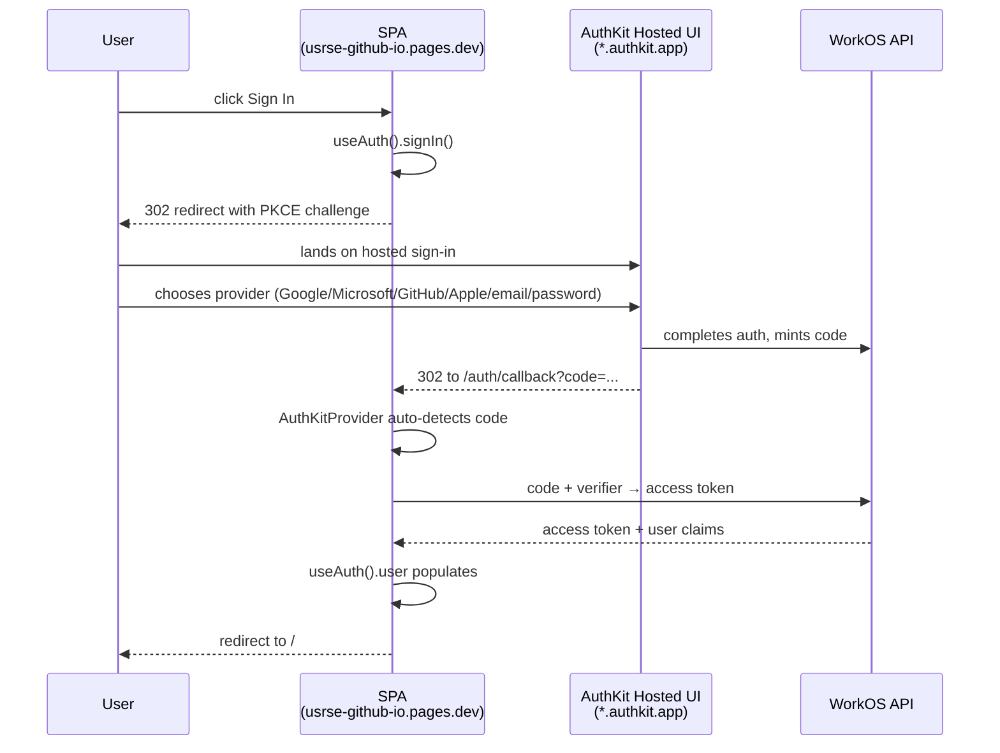

# Authentication

The marketing site uses [WorkOS AuthKit](https://www.workos.com/docs/user-management/authkit) for identity. Auth runs entirely in the SPA via the `@workos-inc/authkit-react` SDK with PKCE — no backend mediates the OAuth dance, and the WorkOS-hosted UI does the heavy lifting.

This document covers what exists today: the sign-in/sign-up flow, environment configuration, and the integration boundary between WorkOS and our Neon database. The DB-side mapping between a WorkOS identity and an internal user row lives in the schema work for [issue #2](https://github.com/USRSE/usrse.github.io/issues/2) and is not yet implemented.

## Why AuthKit + PKCE

| Constraint | Choice |
| --- | --- |
| Static SPA, no backend yet | Use AuthKit's hosted sign-in page (we don't need to render forms) |
| Don't want to write OAuth ourselves | AuthKit React SDK handles the redirect dance, token storage, and refresh |
| Don't want to run a session server today | PKCE keeps the access token in the browser; a backend can be added later for refresh-token persistence |
| Need SSO for university members | WorkOS supports SSO/SAML out of the box |

The decision lineage is in [decisions.md → 2026-04-28: WorkOS for auth](decisions.md) (general direction) and [2026-05-02: AuthKit React SPA via PKCE](decisions.md) (this specific implementation choice).

## Identity flow



The SPA never sees user passwords or third-party OAuth tokens. WorkOS owns identity entirely; the SPA gets a short-lived access token plus user profile claims.

## Components in the codebase

| File | Responsibility |
| --- | --- |
| `apps/web/src/main.tsx` | Reads env, mounts `AuthKitProvider` at the React root, renders config-error fallback if `VITE_WORKOS_CLIENT_ID` is missing |
| `apps/web/src/components/RootErrorBoundary.tsx` | Catches render-time errors (e.g. SDK init failures) and shows a visible error page instead of a silent blank screen |
| `apps/web/src/pages/auth/SignInPage.tsx` | `/sign-in` route — calls `signIn()` on mount, redirects authenticated users home |
| `apps/web/src/pages/auth/SignUpPage.tsx` | `/sign-up` route — calls `signUp()` on mount; all "Join Us" CTAs across the site point here |
| `apps/web/src/pages/auth/CallbackPage.tsx` | `/auth/callback` route — landing zone for the WorkOS redirect; lets the provider process auth params then forwards home |
| `apps/web/src/components/Nav.tsx` | `UserNavSlot` / `UserNavSlotMobile` — swaps Sign In button for an avatar/initials menu when `user` is populated; also exposes Sign Out |

## Environment variables

`apps/web/.env.local` (gitignored) for local development:

```sh
VITE_WORKOS_CLIENT_ID=client_01...
VITE_WORKOS_REDIRECT_URI=http://localhost:5173/auth/callback
```

Cloudflare Pages → Settings → Variables and Secrets → **Production** for the deployed SPA:

| Variable | Value | Type |
| --- | --- | --- |
| `VITE_WORKOS_CLIENT_ID` | WorkOS Client ID | Plaintext |
| `VITE_WORKOS_REDIRECT_URI` | `https://usrse-github-io.pages.dev/auth/callback` | Plaintext |
| `NODE_VERSION` | `24` | Plaintext |

!!! warning "Vite env vars are public"
    Anything prefixed `VITE_` is inlined into the JS bundle at build time and shipped to every visitor's browser. The WorkOS Client ID is fine to expose (that's its design); the WorkOS API Key (server-side only) must never appear in `apps/web/.env*`.

## WorkOS dashboard configuration

| Setting | Value |
| --- | --- |
| Authentication methods enabled | Google, Microsoft, GitHub, Apple, email link, password |
| Redirect URIs | `http://localhost:5173/auth/callback`, `https://usrse-github-io.pages.dev/auth/callback` |
| Branding | Logo: `apps/web/public/us-rse-logo-001.svg`. Primary color: `#741755`. Background: `#ffffff` |

Redirect URIs must match byte-for-byte between the dashboard, the env var, and the route registered in `App.tsx`. A trailing slash mismatch will make AuthKit reject the callback.

## Failure modes and the error boundary

A misconfigured `AuthKitProvider` (e.g. missing or invalid `clientId`) throws synchronously during the React render. Without protection this would fail the root commit and leave `<div id="root"></div>` empty — the dreaded blank page.

Two layers of defense:

1. **Pre-render env check in `main.tsx`** — if `VITE_WORKOS_CLIENT_ID` is falsy, render a config-error page directly without ever touching `AuthKitProvider`.
2. **`RootErrorBoundary`** wrapping `AuthKitProvider` + `<App />` — catches anything else that throws during initial render and displays the error name, message, and stack on the page (also logs to console).

Both arrived after losing time to a "blank page" debugging session against Cloudflare Pages where the actual problem was an empty build output directory, not auth — but the principle holds: never let the app fail invisibly.

## What's not built yet

- **JWT verification in the Worker.** `/api/health` is currently open. Before any endpoint reads user data, the Worker needs to verify the WorkOS-issued access token, extract the `sub` claim, and use it to look up `users.id`.
- **`users` row provisioning.** First sign-in for a new identity needs to create a row in `users` keyed by the WorkOS `sub`. This lives in the schema work for issue #2.
- **Refresh token persistence.** PKCE in the SPA keeps tokens in memory; a real session-aware backend would persist refresh tokens server-side. Acceptable for v1.
- **Production WorkOS environment.** The current setup uses WorkOS staging (the `*-staging.authkit.app` subdomain). Before any real users sign up, flip to the production environment in the WorkOS dashboard, regenerate the Client ID, and update `VITE_WORKOS_CLIENT_ID` in both `.env.local` and Cloudflare Pages.
