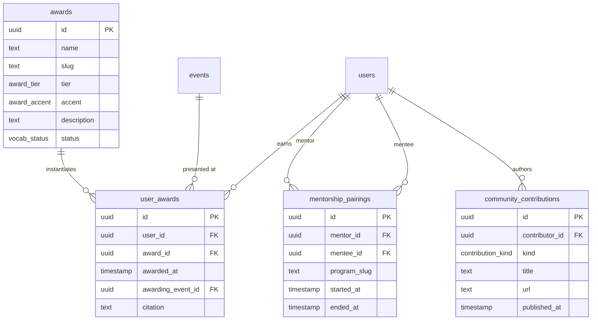

# Badges & Recognition

The dossier's **§04 Recognition** section surfaces every formal credential a member has earned across service, conference participation, community contribution, and milestone arcs. Badges are *computed* from underlying transactional data on every dossier load — there is no `badges` table to keep in sync.

This document covers the badge model, the data sources behind each tier, the visual system, and the phased rollout that grew the catalog from ~12 badges to ~50+.

## Why computed, not stored

A separate `badges` table would require:

- A grant flow (cron job, admin UI, or API hook) to write rows when underlying state changes.
- Backfill scripts for every new badge kind.
- Two sources of truth that can drift (event_attendances says you spoke, but no `Talk` badge exists).

Computing on read means **the badge layer can never lie about the underlying data** — if a row exists in `event_attendances` it produces a chip, no admin intervention required. The cost is recomputing on every `/me` and `/members/:slug` request, which is a few microseconds of work over rows we're already loading.

The trade-off becomes painful only if badge logic gets expensive (many joins, many conditional lookups). Phase 3 added three new tables and we still recompute in single-digit milliseconds — well within the existing dossier-load budget.

## The model

### Tiers

| Tier         | Source kind                                   | Visual weight default | Hero priority                |
| ------------ | --------------------------------------------- | --------------------- | ---------------------------- |
| `service`    | Board / executive terms, awards, committee chairs, group chairs, group coordinators | `double`              | Highest — leads the strip    |
| `milestone`  | Account age, profile completeness, breadth, contributions, mentorship | `solid` or `double` | Mid — sorted by per-id priority |
| `conference` | One per (member, event, role) and one per session presentation       | `solid`               | Lowest of the three tiers — feature only when ≠ `Attended` |

### Accents

`purple` · `teal` · `amber` · `rose` · `graphite` · `neutral` — six color tokens, each with `fill` / `ring` / `ink` / `glyph` / `caption` variants in `apps/web/src/components/profile/HexStamp.tsx`. Accents map to *meaning*, not to *tier*: a teal chip might be a Working Group Chair (service), Cross-Disciplinary milestone, or Tutorial Lead (conference). The eye sorts by color before reading the eyebrow.

### Weights

| Weight    | Visual                   | Reserved for                                                |
| --------- | ------------------------ | ----------------------------------------------------------- |
| `outline` | Hairline border, no fill | Verification marks (ORCID/GitHub/LinkedIn Linked)           |
| `solid`   | Fill + single ring       | Earned, complete events / contributions                     |
| `double`  | Fill + outer ring        | Service tier, milestones, currently-held positions, awards  |

### `BadgeItem` shape

```ts
interface BadgeItem {
  id: string;          // stable; used as React key + scroll target
  tier: BadgeTier;     // service | milestone | conference
  kind: string;        // small mono caption — drives the glyph
  title: string;       // display string under the hex
  subtitle: string;    // sub-caption (e.g. "5+ conferences", "Chair · alumni")
  accent: BadgeAccent;
  earnedAt: string;    // ISO date — used for sort + tooltip
  description: string; // tooltip body
  weight: "solid" | "outline" | "double";
}
```

## Catalog (after Phase 3)

### Service tier

| Badge | Source | Notes |
| --- | --- | --- |
| Board | `leadership_terms` (positionType=board) | Tenure history goes in tooltip; `double` if any open term |
| Executive | `leadership_terms` (positionType=executive) | Same |
| Working Group Chair / Co-Chair | `group_memberships` × `groups` (working_group) | One badge per group |
| Affinity Group Coordinator | `group_memberships` × `groups` (affinity_group) | Same |
| Regional Coordinator | `group_memberships` × `groups` (regional_group) | Same |
| Committee Chair / Co-Chair | `event_committee_assignments` × `event_committee_areas` | Per-area accent; one badge per assignment |
| Award (lifetime / special / annual) | `user_awards` × `awards` | Tier from vocab; year stamp from awarding event when linked |

### Milestone tier

| Badge | Source | Notes |
| --- | --- | --- |
| Charter Member | `users.createdAt` < 2025-09-01 | Excludes legacy imports |
| Founding Roster | `users.isLegacyImport` | Pre-platform members |
| First Stage | First `event_attendances` row with role=speaker | One per user, lifetime |
| Three-Peat / Five-Peat / Decade Roster | Distinct event count ≥3 / ≥5 / ≥10 | Cumulative |
| Speaker · 10 / 25 | Distinct events with role=speaker ≥10 / ≥25 | Lower tier suppressed when higher earned |
| Anniversary 1Y / 5Y / 10Y | `users.createdAt` age | Highest tier only — emit at most one |
| Profile Complete | All six identity fields populated | displayName, headline, bio, jobTitle, institutionName, publicLocation |
| ORCID / GitHub / LinkedIn Linked | Non-null `profile.orcid` / `githubUrl` / `linkedinUrl` | `outline` weight, verification framing |
| Polyglot | `user_languages` count ≥5 | |
| Polymath | `user_skills` count ≥10 | |
| Cross-Disciplinary | `user_disciplines` count ≥3 | |
| Working Group Member / Affinity Group Member / Regional Member | `group_memberships` (role=member) | Lead variants land in service tier |
| Mentor / Mentee | `mentorship_pairings` | Partner name in tooltip iff `partnerIsPublic` |
| Newsletter / Tutorial / Resource Author / Translator / Call Host / Blog / Podcast | `community_contributions` | One per kind; subtitle counts ≥1 rows |
| First Contribution | Earliest `community_contributions.publishedAt` | |
| Sustained Contributor | `community_contributions` count ≥5 | |

### Conference tier (per event)

| Badge | Source | Notes |
| --- | --- | --- |
| Attended | `event_attendances` (role=attendee) | Suppressed when contribution role exists for same event |
| Talk / Poster | `event_attendances` (role=speaker) + `notes` regex | Suppressed when richer session presentation row exists |
| Organized / Sponsored / Volunteered | `event_attendances` (other roles) | Per (member, event, role) |
| Keynote / Plenary | `event_session_presenters` × `event_sessions` × type slug | Premium conference roles — outrank generic Talk |
| Lightning Talk / Tutorial Lead / Workshop Lead / BoF Lead / Panelist | Same | One per session presentation |

## Data flow

```mermaid
graph TD
  Schema[("Postgres tables")]
  Schema -->|users + profiles + leadership_terms| Dossier[loadMemberDossier]
  Schema -->|event_attendances| Dossier
  Schema -->|user_skills + user_disciplines + user_languages| Dossier
  Schema -->|group_memberships + groups| Dossier
  Schema -->|event_committee_assignments + areas| Dossier
  Schema -->|event_session_presenters + sessions + types| Dossier
  Schema -->|user_awards + awards| Dossier
  Schema -->|mentorship_pairings + partner profile| Dossier
  Schema -->|community_contributions| Dossier
  Dossier -->|ComputeInput| Compute[computeBadges]
  Compute -->|BadgeItem[]| Render[HexStamp / RecognitionSection / ProfileHero]
```

`computeBadges` is a pure function (`packages/api/src/lib/badges.ts`) — no I/O, no time-of-day dependency except for `isMembershipCurrent` (compares `leftAt` against `Date.now()`). Easy to test with fixture inputs.

## Visual system

### `HexStamp` — the medal silhouette

Every badge renders as a flat-top hexagon at three sizes (`sm` / `md` / `lg`). The hex itself is a single SVG path inscribed in a 100×100 viewBox. The inner glyph is dispatched by `BadgeGlyph` based on `badge.id` (for milestones with bespoke marks), `badge.kind` (for new tiers added in Phase 2/3), then a switch on conference roles for the legacy paths.

Routing precedence in `BadgeGlyph`:

1. **Specific milestone IDs** (`milestone-three-peat`, `milestone-anniversary-10`, `identity-orcid`, …) — bespoke geometric primitives.
2. **Service kinds** — `Board` → shield, `Executive` → gavel.
3. **Phase 2 kinds** (Keynote, Plenary, Tutorial Lead, WG Chair, …) — themed glyphs.
4. **Phase 3 ID prefixes** (`award-*`, `mentorship-*`, `contribution-*`) — award trophy/ribbon variants, baton-passing figures, content-specific marks.
5. **Conference role switch** — Talk → mic, Poster → poster board, Organized → compass, Sponsored → crown, Volunteered → hand, Attended → year-stamp.

All glyphs are inline SVG. They use `currentColor`-style accent palette and never load external assets.

### Hero featured strip

`pickFeaturedBadges` (`apps/web/src/components/profile/ProfileHero.tsx`) chooses up to 5 chips for the dark gradient banner above the dossier. Priority is:

1. **Service tier** — sort by `earnedAt` descending. Lifetime Achievement awards naturally lead because they're rare and recent.
2. **Milestones** — sort by `FEATURED_MILESTONE_PRIORITY` map. `Sustained Contributor` (priority 0) and `Speaker · 25` (priority 1) outrank everything else; identity verifications and 1-year anniversary are filtered out entirely.
3. **Conference contributions** (`kind ≠ Attended`) — sort by `CONTRIBUTION_KIND_PRIORITY` map. Keynote and Plenary outrank generic Talk; Sponsored/Volunteered fall to the back.
4. **Identity verifications** — last in line; ORCID/GitHub/LinkedIn surface only if the strip has slots left after richer signals.

The full Recognition section below the hero is the canonical surface for everything else.

## Phase 3 schema

Three new tables landed in migration `0008_stormy_penance.sql` (applied 2026-05-07):



### Why three tables

| Choice | Why |
| --- | --- |
| `awards` as vocab + `user_awards` as instances | Mirrors `disciplines` + `user_disciplines`. Admin curates `awards` (8 seeded today); recipients accumulate `user_awards` over time. Multiple winners per award, multiple awards per person. |
| `mentor_id` + `mentee_id` on the same row | One pairing = one row; no need to maintain symmetric "user_a / user_b" relationships. Both sides emit a badge but the row is the source of truth. |
| `community_contributions.kind` enum (vs free text) | Each kind has dedicated badge metadata (label, accent, glyph). Free text would require admin to map post-hoc. Eight enum values covers the realistic universe; `other` is the escape hatch. |

### Mentorship privacy gate

`mentorship_pairings` rows reveal *who you're paired with*. The badge emitter resolves the partner's `profiles.isPublic` flag; the partner display name appears in the tooltip **only** when the partner profile is public. Otherwise the tooltip says "a fellow US-RSE member" and the partner is anonymized.

This is enforced at the badge layer, not the API. A partner who later toggles their profile to private will have their name disappear from existing mentor/mentee badges on the next dossier load — no separate audit, no admin sweep.

## R2 artwork (deferred)

Issue [#1954](https://github.com/USRSE/usrse.github.io/issues/1954) tracks an opt-in path for **premium badge artwork** hosted in R2. The current inline-SVG glyph system is the right call for geometric primitives — they're a few KB total and render at any size — but elaborate illustrations (gold-leaf medals for Lifetime Achievement, animated SVGs for Decade Roster, year-stamped commemoratives for specific conferences) would weigh on the bundle.

Implementation plan when the time comes:

- Add a `BADGE_ARTWORK` R2 binding alongside the existing `PROFILE_PHOTOS`.
- Add an optional `artworkUrl: string | null` to `BadgeItem`.
- Renderer prefers artwork when present, falls back to inline glyph.
- Loading state: skeleton hex with the accent color.

No artwork is required for any Phase 1/2/3 badge. The fallback glyphs are sufficient.

## Phasing summary

| Phase | Issue | Scope | Schema risk |
| --- | --- | --- | --- |
| 1 | [#1951](https://github.com/USRSE/usrse.github.io/issues/1951) | Anniversary, identity, breadth, streak — all derived from existing data | None |
| 2 | [#1952](https://github.com/USRSE/usrse.github.io/issues/1952) | Working group, affinity group, committee, session-type roles — plumbs tables that already exist | None |
| 3 | [#1953](https://github.com/USRSE/usrse.github.io/issues/1953) | Awards, mentorship, contributions — three new tables | One migration (0008) |
| Artwork | [#1954](https://github.com/USRSE/usrse.github.io/issues/1954) | R2-hosted artwork for prestige badges | None — opt-in |

Tracker: [#1955](https://github.com/USRSE/usrse.github.io/issues/1955).

## File map

| Path | Role |
| --- | --- |
| `packages/api/src/lib/badges.ts` | `computeBadges` pure function. All emit logic. ~700 lines. |
| `packages/api/src/lib/dossier.ts` | Loads the badge inputs in a single `Promise.all` batch and threads them into `computeBadges`. |
| `packages/api/src/db/schema/recognition.ts` | Phase 3 tables (`awards`, `user_awards`, `mentorship_pairings`, `community_contributions`). |
| `packages/api/scripts/data/awards.json` | Seeded named awards. |
| `apps/web/src/components/profile/HexStamp.tsx` | Visual rendering — `HexStamp` shell + `BadgeGlyph` switch + 30+ glyph primitives. |
| `apps/web/src/components/profile/RecognitionSection.tsx` | §04 grouping (Service / Milestones / Conferences). |
| `apps/web/src/components/profile/ProfileHero.tsx` | Hero achievements strip + `pickFeaturedBadges`. |
