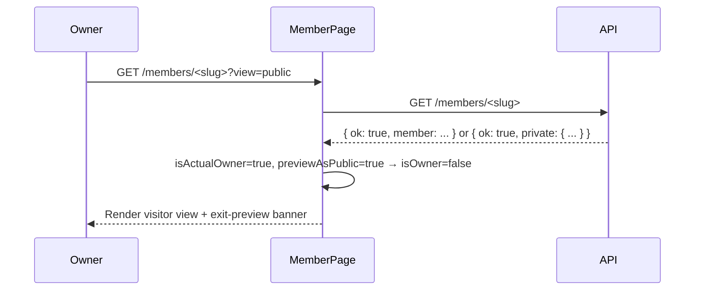
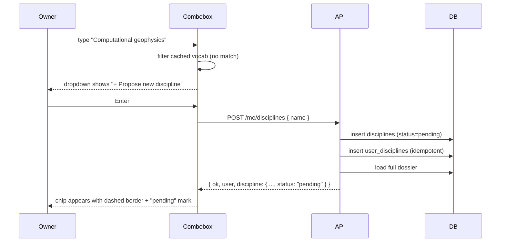

# Dossier — profile, directory, search

The "dossier" is the public-facing member surface — the page at `/members/:slug` and its editor at `/me`. This document covers everything the dossier can do as of 2026-05-07: visibility model, vocab editing, location autocomplete, member directory, and the global cmd-K palette.

For the recognition system rendered at §04 of every dossier, see [Badges & Recognition](./badges.md).

## Routes

| Path | Component | Purpose |
| --- | --- | --- |
| `/me` | `MeRedirect` | Resolves the signed-in user's slug, redirects to `/members/:slug` |
| `/members` | `MembersIndexPage` | Authenticated directory with search + facet filters |
| `/members/:slug` | `MemberPage` | Public dossier view; same route serves owner edit affordances |
| `/members/:slug?view=public` | `MemberPage` (preview) | Owner sees what visitors see |
| `/account` | `AccountPage` | Account ledger — settings + visibility + danger zone |

`/members/:slug` is the canonical URL for both the owner and visitors. Differentiating who's looking happens in the React tree, not in routing — see [Visibility model](#visibility-model) below.

## Visibility model

Three states, derived from two booleans on `profiles`:

| State | `isPublic` | `isDiscoverable` | What visitors see at `/members/:slug` | Listed in `/members` directory? |
| --- | --- | --- | --- | --- |
| Public | `true` | `false` (default) | Full dossier | Yes |
| Listed (private) | `false` | `true` | Stub: name + member ID | Yes |
| Hidden | `false` | `false` | Stub | No |

The owner of a private profile **always sees their own full dossier** when visiting `/members/:slug` — privacy is about what others see, never a lockout from the member's own data.

### Preview-as-public

Owners can append `?view=public` to their own slug URL to see exactly what visitors see, with a thin purple banner pinned at the top offering "Exit preview." The query param flips `isOwner` to false and routes the dossier through the public-payload code path.



### Private profile stub

When a visitor (or the owner in preview) hits a non-public slug, the API returns:

```json
{ "ok": true, "private": { "memberId": "USR-XXXX-NN", "displayName": "Cordero Core" } }
```

The frontend renders a clean stub page with the name, member ID, and a brief "this member has chosen to keep their profile private" — *not* a 404. Shared links don't break when a member toggles privacy. The HTTP status stays 200; privacy is signaled in the body shape, not the status code.

For `Hidden` profiles the API still returns the stub when the URL is correct (someone with a saved link can confirm the member exists) but the slug doesn't appear in the directory.

### Why three states, not two

A binary public/private toggle forces members into a corner: "I want US-RSE members to find me for collaboration, but I don't want my full dossier indexable." `Listed (private)` is the half-measure that makes that case possible. The cost is two booleans and a 3-up radio in the account ledger; the win is that no member feels forced to choose between *findable* and *private*.

## Account ledger

`/account` is reimagined as a typographic ledger document — the back-office record-of-account, not a stack of cards. The dossier owns the purple gradient drama; this page is the supporting document, signaled through restraint (white background, single hairline accent at the top, mono section markers in the gutter).

Sections:

1. **§01 Identity** — email, member ID, role, origin (legacy import flag).
2. **§02 Visibility** — the three-state radio that drives `isPublic` + `isDiscoverable`. Triptych layout with `gap-px` gradient seams quoting the dossier's Affiliation pillar pattern.
3. **§03 Notifications** — marketing email subscription (currently read-only).
4. **§04 Profile** — links to the dossier and the inline editor.
5. **§05 Danger zone** — sign out, delete account (stub).

Inline saves: clicking a visibility option fires `PATCH /me/profile` with the (`isPublic`, `isDiscoverable`) flag pair and updates state on response. No "Save" button — the radio is the action.

## Member directory (`/members`)

Authenticated index of members. Editorial archival-index aesthetic — numbered entries, sticky search bar with `/` keyboard focus, filter sidebar with α/β/γ marker eyebrows for discipline / career stage / country.

```mermaid
graph TD
  Page[/members route]
  Page -->|useVocab| Vocab["GET /vocab"]
  Page -->|useMemberSearch| Search["GET /members?q=&discipline=&careerStage=&country="]
  Page -->|render| Cards[MemberCard]
  Search -->|debounced 200ms| API
  API -->|public profile| FullCard[Public chip with photo, role, institution, disciplines]
  API -->|listed-private profile| StubCard[Stub chip with name + member ID + dashed hex]
```

### Search semantics

- **q** matches `displayName`, `jobTitle`, `headline`, and `institution.name` via `ILIKE '%q%'`. Sequential scan; community is small enough that trigram indexes aren't worth the operational cost.
- **discipline / careerStage / country** are comma-separated UUID lists. Multi-select OR within a facet, AND across facets.
- Results page-paginated 24 at a time. `Load more →` advances offset.
- URL state: filters and `q` round-trip through `useSearchParams` so the page is shareable.

Listed-private members participate in matching — including by facet — but the response only echoes back the stub shape (`{ kind: "private", memberId, displayName }`). Their institution/discipline data is in the DB but never crosses the wire.

## Cmd-K palette

Global keyboard shortcut (`⌘K` / `Ctrl+K`) opens an editorial dark-mode modal that lets you jump to any member by name. Same `/members` search backend as the directory, no facets — the palette optimizes recognition ("I know who I want"), the directory optimizes recall ("show me people who match these criteria").

| Behavior | Implementation |
| --- | --- |
| Auth-gated keyboard listener | Attached only when `useAuth().user` is non-null |
| Dropdown portaled to `<body>` | `createPortal` + measured position via `useLayoutEffect`, recomputed on scroll/resize |
| Keyboard nav | ↑/↓ to highlight, Enter to navigate, Esc to close |
| Click outside | Closes; `mousedown` listener checks both wrapper and portaled menu refs |

The portal pattern is the same one used by `LocationCombobox` — it's the only reliable way to escape the stacking contexts created by `RevealOnView`'s transform-based animations on each profile section.

## Location autocomplete

The `publicLocation` field on the dossier editor is a typeahead combobox backed by [Photon](https://photon.komoot.io/) — the open-source OSM geocoder built specifically for autocomplete.

| Property | Value |
| --- | --- |
| Provider | Photon (Apache 2.0, Komoot's hosted instance) |
| Endpoint | `https://photon.komoot.io/api?q=<term>&limit=8&lang=en` |
| API key | None |
| Data license | OSM ODbL — attribution shown in dropdown footer when results are visible |
| Debounce | 220ms |
| Free-text fallback | Pressing Enter without selecting saves the typed text as `publicLocation` with no coords |

When a user picks a suggestion, the combobox emits a `LocationValue` containing display string, `countryIso2`, city, region, latitude, longitude. The PATCH request includes all of those; the server resolves `countryIso2` → internal `countryId` UUID via the `countries` table.

### Display string vs menu line

Photon results show `Boulder, Colorado · United States` in the dropdown for disambiguation, but only `Boulder, Colorado` is saved as `publicLocation`. The country is stored separately (via `countryIso2` → `countryId`) and the dossier renders `Boulder, Colorado · United States` from the joined country name. Saving the country in *both* places would print it twice.

A defensive de-dupe in the `placeLine` builder catches legacy data: if the saved location already contains the country name (case-insensitive substring), the appended country is suppressed.

## Vocab editing — disciplines, skills, languages

The dossier's §05 Craft section has three vocab axes. Owners edit them inline with `EditableChipList`, a chip ribbon with hover-revealed × on each existing chip and a trailing `+ add` affordance that expands into `VocabCombobox`.



Three rules govern proposed entries:

1. **Slugify and dedupe.** The server slugifies the name, looks for an existing row with that slug, and reuses it if found — handles two users proposing the same term concurrently.
2. **Idempotent linking.** Re-adding a chip the user already has is a no-op via `ON CONFLICT DO NOTHING` on the join row.
3. **Visible pending state.** Pending chips render with a dashed border and a small mono `pending` mark for the owner. Visitors see them as normal chips — the pending state is information for the editor, not a public approval signal.

### Languages as a separate axis

Skills and disciplines existed first; languages were split off in `0007_remarkable_landau.sql`. The migration created `languages` + `user_languages` tables and atomically moved 13 language entries (Python, R, Julia, C/C++, Fortran, JS/TS, Rust, Go, Java, Bash/Shell, MATLAB) out of `skills` along with any user→skill links pointing at them. CTE chain wraps the move so partial failure rolls back the schema change too.

The "Languages" axis exists because:

- Most members have a small finite set ("I write Fortran and Python") rather than a sprawling tool inventory.
- "I write Bash" is a meaningfully different self-description than "I use Snakemake."
- The badge layer's Polyglot milestone (5+ languages) wouldn't make sense with shells and tools mixed into the count.

## API surface

### Public

- `GET /vocab` — filter dimensions for the directory + autocomplete. Returns approved disciplines, skills, languages, career stages, countries.
- `GET /members/:slug` — public dossier or `{ ok, private: { memberId, displayName } }` stub. Status 200 in both cases; status only goes 404 when the slug doesn't match anything.

### Authenticated

- `GET /members?q=&discipline=&careerStage=&country=&limit=&offset=` — search + facet filters. Returns mixed public-rich and private-stub results.
- `GET /me` — full dossier for the signed-in user.
- `PATCH /me/profile` — accepts profile fields, visibility flags, location coords + `countryIso2` (server resolves to `countryId`).
- `POST /me/disciplines` / `POST /me/skills` / `POST /me/languages` — body is `{ id }` for existing or `{ name }` for proposing new. Returns refreshed dossier so the editor doesn't need a separate refetch.
- `DELETE /me/disciplines/:id` / `DELETE /me/skills/:id` / `DELETE /me/languages/:id` — removes the join row.

All `/me` routes verify a WorkOS-issued bearer token via `requireAuth` middleware.

## Profile data shape

The dossier returned by `/me` and `/members/:slug` is a single object — not nested resources. Key fields:

```ts
interface MemberDossier {
  id: string;
  memberId: string;     // formatted USR-XXXX-NN
  email: string;        // /me only — stripped from /members/:slug
  role: string;
  marketingConsent: boolean;     // /me only
  isLegacyImport: boolean;       // /me only
  createdAt: string;
  profile: { /* identity, location, social, isPublic, isDiscoverable */ } | null;
  experiences: ExperienceItem[];
  education: EducationItem[];
  certifications: CertificationItem[];
  skills: VocabItem[];           // { id, name, slug, status }
  disciplines: VocabItem[];
  languages: VocabItem[];
  engagementTypes: { label: string }[];
  conferences: ConferenceItem[];
  leadership: LeadershipItem[];
  works: WorkItem[];
  badges: BadgeItem[];           // computed by computeBadges
}
```

`badges` are computed on every load — see [Badges & Recognition](./badges.md) for the full model.

## File map

| Path | Role |
| --- | --- |
| `apps/web/src/pages/members/MemberPage.tsx` | Routing + visitor/owner branching + privacy stub render |
| `apps/web/src/pages/members/MembersIndexPage.tsx` | Directory page — hero, search, sidebar, results stream |
| `apps/web/src/pages/account/MeRedirect.tsx` | `/me` → `/members/:slug` |
| `apps/web/src/pages/account/AccountPage.tsx` | Account ledger — visibility radio + inline save |
| `apps/web/src/pages/account/ProfileView.tsx` | Shared dossier render for owner + visitor |
| `apps/web/src/components/profile/IdentitySection.tsx` | §01 inline editor — name, headline, bio, location, photo |
| `apps/web/src/components/profile/CraftSection.tsx` | §05 vocab section — owner sees `EditableChipList`, visitors see read-only ribbons |
| `apps/web/src/components/profile/EditableChipList.tsx` | Chip ribbon with × per chip + `+ add` combobox |
| `apps/web/src/components/profile/VocabCombobox.tsx` | Generic typeahead with propose-new affordance |
| `apps/web/src/components/profile/LocationCombobox.tsx` | Photon-backed location autocomplete |
| `apps/web/src/components/members/CommandPalette.tsx` | Global ⌘K palette |
| `apps/web/src/components/members/MemberCard.tsx` | Result card for directory + stub variant |
| `apps/web/src/hooks/useCurrentMember.ts` | `/me` fetch + state machine |
| `apps/web/src/hooks/usePublicMember.ts` | `/members/:slug` fetch with `private` status branch |
| `apps/web/src/hooks/useMemberSearch.ts` | Debounced `/members?q=…` with cancellation |
| `apps/web/src/hooks/useVocab.ts` | One-shot fetch of `/vocab` |
| `packages/api/src/routes/me.ts` | `/me` GET + PATCH + photo + vocab edit endpoints |
| `packages/api/src/routes/members.ts` | `GET /members` (search) + `GET /members/:slug` (stub-aware) |
| `packages/api/src/routes/vocab.ts` | `GET /vocab` |
| `packages/api/src/lib/dossier.ts` | `loadMemberDossier` and the slug-resolve helper |
| `packages/api/src/lib/member-search.ts` | Search query + result shape |
