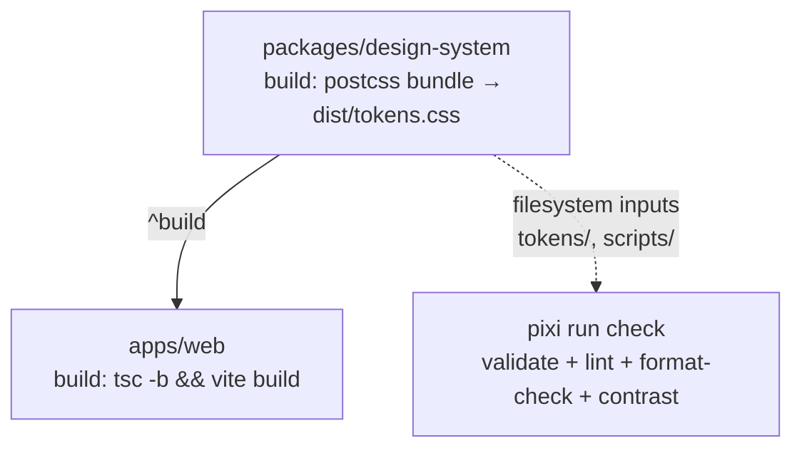

## Monorepo Structure

The repository is organized as a [Turborepo](https://turbo.build/) monorepo with npm workspaces. Apps live under `apps/`, shared packages under `packages/`. A single root install hoists shared dependencies; Turbo orchestrates `build`, `dev`, `lint`, `typecheck`, and `test` pipelines across workspaces.

This layout was introduced as part of issue [#1934](https://github.com/USRSE/usrse.github.io/issues/1934) (epic [#1933](https://github.com/USRSE/usrse.github.io/issues/1933)) so that the marketing site, the upcoming elections app, and the shared design system can co-exist with one install, one lockfile, and one CI pipeline.

## Layout

```
usrse.github.io/
├── apps/
│   └── web/                      # @us-rse/web — Vite + React marketing site
├── packages/
│   └── design-system/            # @us-rse/design-system — CSS tokens
├── docs/                         # Markdown docs (this directory)
├── public/                       # Source images shared across apps
├── turbo.json                    # Turborepo task pipeline
├── package.json                  # Workspaces config + turbo scripts
├── pixi.toml                     # Token tooling (Node + Python tools)
└── .gitignore
```

Future apps land under `apps/` (e.g., `apps/elections/`); future shared packages land under `packages/` (e.g., `packages/ui-components/`).

## Workspaces

Defined in root `package.json`:

```json
{
  "workspaces": ["apps/*", "packages/*"]
}
```

| Workspace                  | Path                       | Role                                                            |
| -------------------------- | -------------------------- | --------------------------------------------------------------- |
| `@us-rse/web`              | `apps/web`                 | Public marketing site. Vite + React 19 + TypeScript 6.          |
| `@us-rse/design-system`    | `packages/design-system`   | CSS design token system. Publishes `dist/tokens.css`.           |

Cross-workspace dependencies use the `*` version specifier and resolve to symlinks under the root `node_modules/@us-rse/`:

```jsonc
// apps/web/package.json
{
  "dependencies": {
    "@us-rse/design-system": "*"
  }
}
```

## Turborepo Pipeline

`turbo.json` declares five tasks. `^build` means "run `build` in workspaces this one depends on first."

| Task        | Depends on  | Cache outputs                                  | Notes                                  |
| ----------- | ----------- | ---------------------------------------------- | -------------------------------------- |
| `build`     | `^build`    | `dist/**`, `build/**`, `.next/**`              | Hashed inputs include `src/**`, `tokens/**`, configs |
| `dev`       | —           | none (`cache: false`, `persistent: true`)      | Long-running watcher                   |
| `lint`      | `^build`    | none                                           | Runs ESLint per workspace              |
| `typecheck` | `^build`    | none                                           | `tsc -b --noEmit` for typed workspaces |
| `test`      | `^build`    | `coverage/**`                                  | Reserved for future test suites        |

Run from repo root:

```bash
npm run dev          # turbo run dev
npm run build        # turbo run build
npm run lint         # turbo run lint
npm run typecheck    # turbo run typecheck
```

Or scope to one workspace:

```bash
npm -w @us-rse/web run dev
npm -w @us-rse/web run build
```

## Build Graph



Turbo treats `@us-rse/design-system` as an upstream dependency of `@us-rse/web`. Today the design-system has no `build` script invoked by Turbo (the bundle is produced by `pixi run build` against the token sources directly); the dependency edge is in place so that when the package gains a JS build step it slots in without rewiring anything.

## Pixi for Token Tooling

`pixi.toml` is retained at the repo root and handles tooling that lives outside the JS/TS world (stylelint, prettier, contrast checker, validator, watcher). All paths point at `packages/design-system/...`:

```toml
build    = "node packages/design-system/scripts/build.mjs"
validate = "node packages/design-system/scripts/validate-tokens.mjs"
contrast = "node packages/design-system/scripts/check-contrast.mjs"
dev      = "node packages/design-system/scripts/watch.mjs"
lint     = "stylelint 'packages/design-system/tokens/**/*.css'"
format   = "prettier --write 'packages/design-system/**/*.css'"
```

`pixi run check` chains validate → lint → format-check → contrast and is the design-system quality gate. Turbo does not invoke pixi; the two systems sit side-by-side.

## Token Bundle Output

`packages/design-system/scripts/build.mjs` resolves all `@import` chains in `tokens/index.css` and writes:

| File                                       | Purpose                              |
| ------------------------------------------ | ------------------------------------ |
| `packages/design-system/dist/tokens.css`   | Readable bundle for development      |
| `packages/design-system/dist/tokens.min.css` | Minified bundle for production     |

The package's `exports` field surfaces these so consumers can import either:

```js
import "@us-rse/design-system";              // → dist/tokens.css
import "@us-rse/design-system/tokens.min.css"; // → minified
```

`apps/web` does not currently consume the bundled CSS — its `src/index.css` defines the Tailwind theme inline. The workspace edge exists so that future apps (and a future refactor of the web app) can pull tokens via the package boundary instead of relative paths.

## Migration Notes

What moved during the [#1934](https://github.com/USRSE/usrse.github.io/issues/1934) restructure:

| Before                          | After                                            |
| ------------------------------- | ------------------------------------------------ |
| `web/`                          | `apps/web/`                                      |
| `design-system/`                | `packages/design-system/`                        |
| `scripts/` (root)               | `packages/design-system/scripts/`                |
| `dist/` (root)                  | `packages/design-system/dist/`                   |
| Two `package-lock.json` files   | One root `package-lock.json` (workspaces)        |

Script-internal paths now resolve relative to `pkgRoot = scripts/..` instead of `repo-root/design-system`. The watcher's child `pixi run` invocations explicitly `cd` to `repoRoot` so pixi can locate `pixi.toml`.

## Adding a New App or Package

1. Create the directory: `apps/<name>/` or `packages/<name>/`
2. Add a `package.json` with `"name": "@us-rse/<name>"` and `"private": true`
3. Run `npm install` from the repo root — the workspace is picked up automatically
4. Define `build` / `dev` / `lint` / `typecheck` scripts to plug into the Turbo pipeline
5. If the new workspace consumes the design system, add `"@us-rse/design-system": "*"` to its dependencies

## Verification

```bash
pixi run check                # design-system quality gate
npx turbo run build           # all workspace builds
npm -w @us-rse/web run build  # single-app build
```

All three currently exit 0 from a clean clone after `npm install` + `pixi install`.
