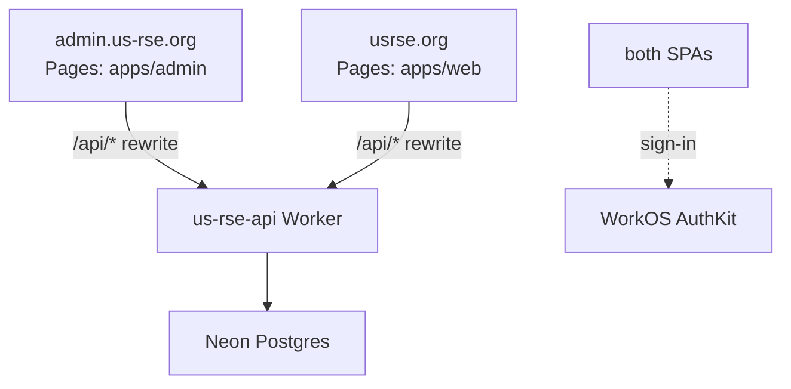
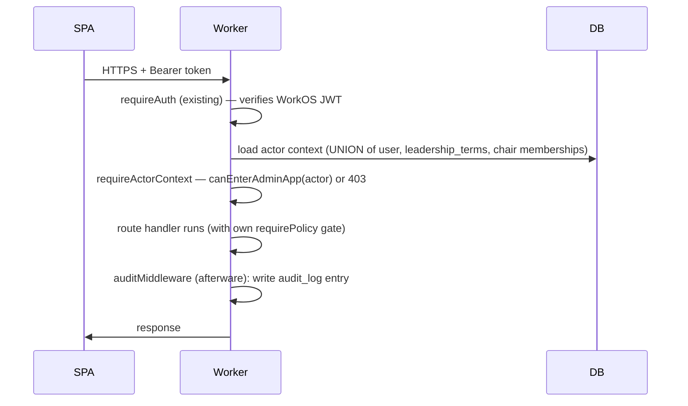

# Admin App — Foundation Design

**Status:** Approved
**Date:** 2026-05-09
**Hostname:** `admin.us-rse.org`

## Goal

Establish the foundation for the US-RSE admin application — the workspace, auth posture, role/permission model, audit infrastructure, and frontend shell that every subsequent admin subsystem (members, vocab, organizations, groups, events, recognition, forms, elections, communications, operations) inherits without rework.

This spec is intentionally not a feature spec. It contains no domain logic for any specific admin task. Each subsystem listed in the appendix gets its own brainstorm → spec → plan → implementation cycle once the foundation lands.

## Non-goals

- Admin UI for any subsystem beyond Dashboard and Audit. Stubs only.
- A "permissions admin" UI for granting/revoking the `staff` / `super_admin` role. Manual SQL until the Identity subsystem ships.
- Custom DNS for the API itself (still `*.workers.dev`).
- Step-up auth / 2FA posture. Layered in later when destructive actions feel real.
- Email-based admin notifications. Lands with the Communications subsystem.

## Architecture overview

```
apps/
  web/                  ← public site (existing)
  admin/                ← NEW: admin SPA, served at admin.us-rse.org

packages/
  api/                  ← single Worker; adds /api/admin/* sub-app
  design-system/        ← unchanged, shared
  auth-shell/           ← NEW: extracted WorkOS provider + helpers
```

Both Pages projects rewrite `/api/*` → the same Worker. The admin SPA explicitly calls `/api/admin/*` for elevated routes; it can also call existing `/api/me`, `/api/vocab`, etc. for read-only context.



Zero admin code ships to `apps/web`. Shared concerns (WorkOS provider, design-system tokens, the API client wrapper) move into small packages so both apps consume them as workspace deps, not relative imports.

## Role and permission model

### System role enum

`user_role` becomes three tiers:

- `member` — default; not an admin.
- `staff` — operates the platform (vocab approvals, user merge, communications). Replaces today's `admin`.
- `super_admin` — staff + access to settings, role assignment, audit log, destructive actions.

Migration path: add `staff`, backfill `WHERE role = 'admin'`, deprecate `admin` in a follow-up rev once deploys soak. No row data is at risk.

### Relational positions (already in DB)

These tables already model "admin-shaped" relationships and are the source of truth for distributed admin:

| Source | Confers |
|---|---|
| `leadership_terms` (positionType: board / executive / staff / advisor), active term | board membership, executive role, etc. |
| `group_memberships.role = 'chair' \| 'co_chair'`, active row | chair of *that group* |
| `event_committee_assignments.level = 'chair' \| 'co_chair'` | chair of *that event's committee* |

### Actor context

On every admin request, an early middleware loads `ActorContext` once and stashes it on `c.var`:

```ts
type ActorContext = {
  user: { id; memberId; email; role: "member" | "staff" | "super_admin" };
  systemTier: 0 | 1 | 2;                  // 0=member, 1=staff, 2=super_admin
  leadershipPositions: LeadershipTerm[];  // active terms only
  chairedGroupIds: Set<string>;           // groups they chair or co-chair
  chairedEventIds: Set<string>;           // events they chair on committee
};
```

One DB query (a UNION) builds it. Policies are pure functions over this object — no DB calls inside policy bodies.

### Policies

Code-as-source-of-truth policies live at `packages/api/src/lib/policies/`. Each policy is a pure function over `ActorContext` (and an optional scope):

```ts
export const canEnterAdminApp = (a: ActorContext): boolean =>
  a.systemTier >= 1 ||
  a.leadershipPositions.length > 0 ||
  a.chairedGroupIds.size > 0 ||
  a.chairedEventIds.size > 0;

export const canApproveVocab = (a: ActorContext): boolean =>
  a.systemTier >= 1;

export const canMergeUsers = (a: ActorContext): boolean =>
  a.systemTier >= 2;

export const canEditGroup = (
  a: ActorContext,
  scope: { groupId: string }
): boolean =>
  a.systemTier >= 1 || a.chairedGroupIds.has(scope.groupId);

export const canEditEvent = (
  a: ActorContext,
  scope: { eventId: string }
): boolean =>
  a.systemTier >= 1 || a.chairedEventIds.has(scope.eventId);

export const canViewAuditLog = (a: ActorContext): boolean =>
  a.systemTier >= 2;
```

A `requirePolicy` middleware factory mounts a policy as a route guard:

```ts
export function requirePolicy<S>(
  policy: (a: ActorContext, scope: S) => boolean,
  scopeFn: (c: Context) => S
) {
  return async (c, next) => {
    const actor = c.get("actor");
    if (!policy(actor, scopeFn(c))) {
      return c.json({ ok: false, error: "forbidden" }, 403);
    }
    await next();
  };
}

// Usage:
adminApp.put("/groups/:id",
  requirePolicy(canEditGroup, c => ({ groupId: c.req.param("id") })),
  async c => { /* ... */ }
);
```

For mid-handler checks (touching multiple scoped resources), call the policy directly: `if (!canEditGroup(actor, { groupId })) return c.json(..., 403)`.

### Frontend mirror

A small `apps/admin/src/policies.ts` re-implements the same functions over the `ActorContext` shape returned by `/api/admin/me`. Components show or hide affordances based on the same logic. Server is the gate; FE policies are defense in depth, not security.

## Auth, audit, and the request lifecycle

### Sign-in

Same WorkOS project, same `@us-rse/auth-shell` package wrapping `AuthKitProvider`. `apps/admin` registers its own redirect URI (`https://admin.us-rse.org/auth/callback`) plus the preview pattern (`https://*.us-rse-admin.pages.dev/auth/callback`) in WorkOS. PKCE in browser, no backend session — identical posture to the public site.

### Front-end gate

After sign-in, the SPA fetches `/api/admin/me`. The Worker computes `ActorContext` and returns `{ user, systemTier, positions: { leadership, chairedGroups, chairedEvents } }`. If `canEnterAdminApp(actor)` is false, the SPA renders a "you don't have access" page and offers sign-out — no admin chrome, no nav, no list calls.

### Server gate

Request lifecycle on `/api/admin/*`:



Three middleware on the `/api/admin/*` sub-app, in order:

1. **`requireAuth`** — already exists. Verifies WorkOS access token, populates `c.var.workosUserId`.
2. **`requireActorContext`** — new. Walks the user merge chain to canonical, loads positions and chairships, populates `c.var.actor`. Returns 403 if `canEnterAdminApp` fails. Returns 404 with `error: "user_pending"` if the user row hasn't been provisioned yet.
3. **`auditMiddleware`** — new. Runs as afterware. Builds an audit entry with the standard fields plus any handler-supplied payload, writes to `audit_log`.

### Mutation-aware audit

For mutating routes (POST / PUT / PATCH / DELETE), handlers expose two affordances on `c.var`:

- `c.var.auditCapture(prior)` — call right after fetching the row about to change. Stashes a serializable snapshot.
- `c.var.auditPayload = { ... }` — set anytime; the middleware merges this into the final payload.

The middleware then writes:

```jsonc
{
  "actorId": "...",
  "actorRole": "staff",
  "action": "users.merge",
  "targetType": "users",
  "targetId": "<canonical user id>",
  "payload": {
    "method": "POST",
    "path": "/api/admin/users/abcd/merge",
    "status": 200,
    "durationMs": 142,
    "before": { /* prior snapshot, captured by handler */ },
    "after":  { /* final state, captured by handler or middleware */ },
    "reason": "<optional reason from request body>"
  },
  "ipAddress": "...",
  "createdAt": "..."
}
```

Handlers that don't capture explicit before/after still produce a usable row — at minimum: actor, action, target, payload, timestamp. Before/after captures are added handler-by-handler as subsystems land, prioritizing irreversible-feeling actions (user merge, vocab status change, role assignment, leadership term termination).

### Token / role-change handling

WorkOS tokens are short-lived. When `users.role` changes, the change takes effect on the user's *next request* because `requireActorContext` re-loads positions per request. No token refresh needed. The SPA polls `/api/admin/me` every 60s in the shell layout to close the window where a demoted user still has admin chrome rendered.

### Audit reader

Two surfaces in the SPA:

- **`/admin/audit`** — global timeline, paginated, filterable by `actor`, `action`, `targetType`, date range. `super_admin` only.
- **Per-target inlines** — every detail page (user, group, event, organization, vocab term) shows a "Recent admin activity" panel listing the last N audit rows where `targetType` and `targetId` match. Visible to anyone who can edit that target.

Endpoint: `GET /api/admin/audit?actorId=&action=&targetType=&targetId=&from=&to=&cursor=`. Cursor-paginated by `(created_at desc, id desc)` so the existing index is hit cleanly. Limit 50/page, max 200.

## Frontend shell

### Layout

Three regions — narrow sidebar, top bar, main. Sidebar persistent on desktop, drawer on mobile.

```
┌──────────────────────────────────────────────────────┐
│ logo        breadcrumb                user ▾  staff │   ← top bar
├──────┬───────────────────────────────────────────────┤
│ §01  │                                               │
│ §02  │              main content                     │
│ §03  │                                               │
│ ...  │                                               │
│      │                                               │
│ Audit│                                               │
└──────┴───────────────────────────────────────────────┘
```

The sidebar mirrors the dossier's numbered-section vocabulary (`01 Identity`, `02 Affiliation`, …) for editorial consistency across surfaces.

### Adaptive sidebar

A `useNavSections()` hook builds the list from `ActorContext`:

| Item | Visible when |
|---|---|
| Dashboard | always |
| Members | `systemTier >= 1` |
| Organizations | `systemTier >= 1` |
| Vocab queue | `systemTier >= 1` |
| Groups | `systemTier >= 1` *or* `chairedGroupIds.size > 0` (scoped list) |
| Events | `systemTier >= 1` *or* `chairedEventIds.size > 0` (scoped list) |
| Recognition | `systemTier >= 1` |
| Settings | `systemTier >= 2` |
| Audit | `systemTier >= 2` |

Group/event chairs see only the groups/events they chair. Server-side `requirePolicy` is the actual gate; sidebar is UX.

### Foundation ships only Dashboard + Audit

Every other section starts as a placeholder route rendering a "Coming soon — see specs/YYYY-MM-DD-…md" stub. Each subsystem spec replaces its stub when its work lands. Foundation deploys end-to-end without waiting on feature work.

### Routing and file structure

```
apps/admin/src/
  main.tsx                    ← AuthKitProvider mount
  App.tsx                     ← top-level routes
  layout/
    AdminShell.tsx            ← sidebar + topbar layout
    NotEntitled.tsx           ← shown when canEnterAdminApp fails
  pages/
    DashboardPage.tsx         ← MVP landing
    AuditPage.tsx             ← global audit timeline
    auth/                     ← /auth/callback etc., uses auth-shell
    members/                  ← stubs for now
    organizations/            ← stubs
    vocab/                    ← stubs
    groups/                   ← stubs
    events/                   ← stubs
    recognition/              ← stubs
    settings/                 ← stubs
  hooks/
    useActorContext.ts        ← /api/admin/me hook
    useNavSections.ts         ← actor-aware sidebar list
  policies.ts                 ← FE mirror of server policies
  lib/
    api.ts                    ← fetch wrapper, reuses auth-shell
```

### Dashboard MVP content

- Greeting with actor's display name and roles ("Welcome, Cordero — staff, board member").
- Tile: "Pending vocab terms" — count of `status='pending'` rows across disciplines/skills/languages/organizations. Links to vocab queue. (`systemTier >= 1` only)
- Tile: "Recent admin activity" — last 10 audit rows. (`systemTier >= 2` only)
- Tile: "Cross-email duplicate candidates" — count from the 84-group audit query, links to `/admin/members?duplicates=true`. (`systemTier >= 2`)
- For chairs only: "My groups" / "My events" with quick-link rows.

These reads are real enough to validate the shell + auth + actor context end-to-end, and useful enough to keep using as features land.

### Look and feel

Reuses `@us-rse/design-system` tokens. Visual treatment is a denser, mono-leaning variant of the public site — same purple/teal palette, but tighter spacing, more tabular layouts, less editorial typography. Signal: workspace, not magazine.

- Top bar: white background, thin purple top accent (matches public nav).
- Sidebar: light neutral fill, mono labels, numbered prefixes.
- Tables for list views (not cards). Sticky column headers, row-hover highlight.
- Toast notifications for action confirmations + audit-trail nudges ("Recorded — see audit log").
- Reuse `HexStamp` / `OrgLogo` / `InitialsHex` for member rows and org rows so the visual vocabulary is consistent across surfaces.

## Build, deploy, and dev experience

### Workspace layout

```
apps/admin/
  package.json            ← name: @us-rse/admin
  vite.config.ts          ← dev proxy /api → :8787
  index.html
  public/
    _redirects            ← /api/* → Worker URL :splat (200), /* → /index.html
  src/
    ...                   ← per shell section above
  tsconfig.json           ← extends repo base; references design-system + auth-shell

packages/auth-shell/
  package.json            ← name: @us-rse/auth-shell
  src/
    AuthProvider.tsx      ← extracted AuthKitProvider mount with config validation
    useApi.ts             ← Bearer-token fetch wrapper, env-aware
    RootErrorBoundary.tsx ← extracted from apps/web
    types.ts
  index.ts
```

`auth-shell` is extracted from `apps/web` as part of the foundation work. The public app starts consuming the package; the admin app consumes the same package. Net zero behavioral change for `apps/web`, no divergent copies six months from now.

### Vite dev proxy

Same pattern as web. Vite proxies `/api/*` to `http://localhost:8787` (local wrangler dev). One Worker process serves both SPAs in dev. Default ports: web on `5173`, admin on `5174`.

### API code organization

```
packages/api/src/
  routes/
    me.ts, members.ts, vocab.ts, webhooks.ts   ← existing
    admin/                                     ← NEW
      index.ts            ← Hono sub-app, mounts middleware + child routers
      me.ts               ← GET /api/admin/me → { actor, positions, tiles }
      audit.ts            ← GET /api/admin/audit
      users.ts            ← stub for now (Identity subsystem fills it)
      organizations.ts    ← stub
      vocab.ts            ← stub
      groups.ts           ← stub
      events.ts           ← stub
      recognition.ts      ← stub
  middleware/
    auth.ts               ← existing requireAuth
    actorContext.ts       ← NEW: requireActorContext + admin entry gate
    audit.ts              ← NEW: auditMiddleware afterware
    policy.ts             ← NEW: requirePolicy factory
  lib/
    policies/
      index.ts            ← re-exports
      canEnter.ts
      canEditGroup.ts
      canMergeUsers.ts
      canApproveVocab.ts
      canViewAuditLog.ts
```

### CI / deploy

Each Pages project gets its own GitHub Actions lane. The existing web deploy stays as-is. New admin lane uses path filters so an `apps/web` change doesn't burn admin CI minutes and vice versa:

```yaml
# .github/workflows/deploy-admin.yml — sketch
on:
  push:
    branches: [main]
    paths:
      - "apps/admin/**"
      - "packages/auth-shell/**"
      - "packages/design-system/**"
jobs:
  deploy:
    steps:
      - install
      - turbo run build --filter=@us-rse/admin
      - wrangler pages deploy apps/admin/dist --project-name us-rse-admin
```

The Worker deploys on its own existing schedule; changes under `packages/api/**` trigger that lane.

### DNS / hosting

Cloudflare Pages project `us-rse-admin` with `admin.us-rse.org` wired as a custom domain in the Pages dashboard. Branch deploys produce preview URLs like `pr-42.us-rse-admin.pages.dev`. WorkOS gets the production redirect URI registered (`https://admin.us-rse.org/auth/callback`) plus the preview pattern.

### Environment variables

- `apps/admin` ships with the same WorkOS client ID as `apps/web` (same project).
- Worker `.dev.vars` is unchanged.
- `VITE_API_BASE_URL` (already in use on web) is honored by admin too.

### Testing strategy at the foundation layer

Three targeted layers, not the full pyramid:

- **Policy unit tests** (Vitest) for every function in `lib/policies/` — pure functions over `ActorContext`, trivial to write, catch the security-critical bit. Foundation ships with tests for `canEnterAdminApp`, `canEditGroup`, `canMergeUsers`, `canApproveVocab`, `canViewAuditLog`.
- **Middleware integration test** for `auditMiddleware` — a fake handler mutates a row, the middleware writes an audit entry, the test asserts the row shape. One test, shared helper used by every later subsystem.
- **One end-to-end smoke** that signs into a test admin user and hits `/api/admin/me`, asserts the actor context shape, and clicks through to `/admin/audit`. Catches deploy-time integration breaks.

No feature-level tests in foundation — those land with each subsystem.

## Deliverables

The foundation spec ships these mergeable work units:

1. `packages/auth-shell` extracted from `apps/web`.
2. Role rename: add `staff` enum value, backfill `WHERE role='admin'`, deprecate `admin` in follow-up.
3. `lib/policies/` directory with the five foundation policies + Vitest tests.
4. `requireActorContext` middleware + `GET /api/admin/me` route.
5. `requirePolicy` middleware factory + the admin entry gate (`requirePolicy(canEnterAdminApp, () => undefined)` mounted on the sub-app).
6. `auditMiddleware` + `GET /api/admin/audit` reader (cursor-paginated, super_admin only).
7. `apps/admin` Vite + React 19 + React Router 7 + design-system workspace.
8. Admin shell — sidebar, top bar, dashboard, audit reader, plus stub routes for every future subsystem.
9. `_redirects` + Pages project + DNS for `admin.us-rse.org`.
10. GitHub Actions lane: `deploy-admin.yml` with path filters.
11. WorkOS redirect URIs registered for the admin host + preview pattern.
12. One end-to-end smoke test of the foundation.

## Risks and consciously-accepted tradeoffs

| Risk | Stance |
|---|---|
| Two SPAs share `@us-rse/auth-shell`; a breaking change there means coordinated deploys. | Accepted. Shell is small. Versioning later if it grows. |
| Permissions live in code, not data — non-engineers can't tune them. | Deliberate. Auth changes should be PR-reviewed and shipped, not edited live. |
| Middleware audit captures *every* mutating request, including no-op PUTs. | Acceptable noise; the alternative (handlers remember to call `audit()`) silently skips actions. |
| Group/event chairs sign in to `admin.us-rse.org` instead of editing inline on the public site. | Deliberate. Cleaner blast radius and bundle boundary. |
| Distributed admin role list duplicates state across `users.role`, `leadership_terms`, `group_memberships`. | Deliberate two-axis model. The domain genuinely has multiple independent kinds of admin position. |
| Token doesn't refresh on role change — a demoted user keeps UI affordances until next request. | Acceptable. Server is the gate; UI is convenience. 60s shell revalidation closes the window. |
| `apps/admin` needs the same WorkOS-config drift defenses `apps/web` learned. | Solved by extracting `auth-shell` — env-check guard + root error boundary come along. |

## Subsequent specs to write

Each is its own brainstorm → spec → plan → implementation cycle. Order is not load-bearing.

| # | Subsystem | Foundation primitives it consumes |
|---|---|---|
| 1 | **Identity & members** (incl. user merge) | `requirePolicy(canMergeUsers)`, audit before/after capture, member list table |
| 2 | **Vocab curation** | `requirePolicy(canApproveVocab)`, list/approve/reject/merge UI for the four vocab tables |
| 3 | **Organizations** (logos + memberships + sponsorships) | R2 binding (deferred), `org_memberships`, `event_sponsorships` |
| 4 | **Groups** | `canEditGroup` for chair-scoped writes, group page editor, chair assignment UI |
| 5 | **Events & sessions** | `canEditEvent`, event lifecycle, committee assignment UI, sponsor wiring |
| 6 | **Recognition** | Awards lifecycle, mentorship pairings, contributions logging |
| 7 | **Forms & surveys** | Likely a fresh subsystem with its own data model (no schema today) |
| 8 | **Elections** | May coordinate with the existing `apps/web` "Elections" page or live as its own app |
| 9 | **Communications** | Email provider decision (Resend / Postmark / similar), template management, send queue |
| 10 | **Operations & analytics** | Dashboards built from existing tables; audit log analytics |

## Decisions made during brainstorming

Each numbered decision corresponds to a clarifying question answered during the brainstorming session. They live here so future readers can see why the foundation looks the way it does.

1. **App architecture** — separate `apps/admin` workspace, separate Cloudflare Pages project, `admin.us-rse.org` as custom domain. Same Worker.
2. **Role and permission model** — two-axis: small system-role enum (`member` / `staff` / `super_admin`) plus relational positions already modeled in the schema. Code-as-source-of-truth policies in `lib/policies/`. Rename `admin` → `staff`.
3. **Auth gating** — anyone with any active admin position (system or distributed) can sign in to `admin.us-rse.org`. Shell adapts per actor. Group/event chairs do not edit through the public site.
4. **Audit logging** — Hono middleware on the `/api/admin/*` namespace writes one entry per mutating request. Handlers enrich payload via `c.var.auditPayload` and `c.var.auditCapture(prior)`. In-app reader at `/admin/audit` plus per-target inlines.
5. **Permission check pattern** — code-defined policy module + `requirePolicy` middleware factory. Actor context loaded once per request.
6. **API location** — same Worker, `/api/admin/*` prefix. Same WorkOS project (members and admins are the same humans).
