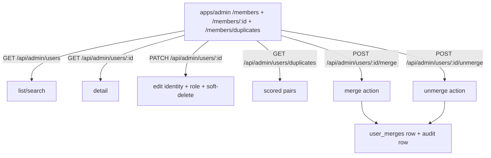

# Admin App — Identity & Members Subsystem

**Status:** Approved
**Date:** 2026-05-11
**Tracks:** GitHub issue #1957
**Builds on:** [`2026-05-09-admin-app-foundation-design.md`](./2026-05-09-admin-app-foundation-design.md)

## Goal

Give super-admin and staff a full identity surface inside `admin.us-rse.org` for the US-RSE membership: list and search the directory, edit identity fields and roles on individual members, soft-delete and restore accounts, surface a scored duplicate-candidate queue, fold duplicates together with a reversible merge, and unmerge when needed.

Resolves the 84 candidate cross-email duplicate groups identified in the foundation work without leaving SQL as the only path.

## Non-goals

- Editing affiliations from the admin app (deferred to the organizations subsystem at #1959; the detail page shows a read-only summary).
- Editing email addresses (read-only, managed by WorkOS).
- Impersonating a member (out of scope for the foundation horizon; admins read records, they do not become them).
- WorkOS-side session revocation on soft-delete (separate concern; locking out of our app is the goal).
- Multi-merge (folding three+ users in one transaction). Admins merge pairwise.

## Architecture overview

The subsystem lives entirely under `apps/admin` plus a new `/api/admin/users/*` sub-app on the existing Worker. Three new server-side capabilities:

1. A **users sub-app** at `/api/admin/users` — list, search, detail, update, soft-delete, role-assignment, plus a child router at `/api/admin/users/:id/merge` and `/unmerge`.
2. A **duplicate-candidates endpoint** at `/api/admin/users/duplicates` — runs the multi-signal scoring on-demand, returns top-100 scored pairs.
3. A new **`user_merges` table** — one row per merge action with the repointed-rows manifest and promoted-fields payload. Unmerge replays against this.

Three new frontend surfaces under the admin shell:

- `/admin/members` — searchable directory.
- `/admin/members/:id` — detail view with editable identity fields, role assignment, affiliations summary, audit history.
- `/admin/members/duplicates` — scored candidate queue and the merge wizard.



Gating:
- Directory list, detail view, identity edits: `canEditMembers` (new policy, `systemTier >= 1`).
- Role promotion: `canPromoteToRole(actor, { newRole })` — staff can set to `member` or `staff`; only super_admin can grant `super_admin`.
- Merge, unmerge, duplicates queue: existing `canMergeUsers` (super_admin only).

## Schema additions

One new table. Everything else is already in place (`users.merged_into_user_id` from Phase 2.5, `audit_log` from foundation).

### Migration `0013_user_merges`

```sql
-- Records each user-merge admin action so it stays reversible.
-- The repointed-rows manifest lets the unmerge endpoint replay the
-- FK moves in reverse; the promoted-fields payload records exactly
-- which canonical fields were overwritten so unmerge can restore them.

CREATE TABLE "user_merges" (
  "id" uuid PRIMARY KEY DEFAULT gen_random_uuid() NOT NULL,
  -- The user that disappeared (became merged_into the target).
  "source_user_id" uuid NOT NULL REFERENCES "users"("id") ON DELETE RESTRICT,
  -- The user that absorbed the source.
  "target_user_id" uuid NOT NULL REFERENCES "users"("id") ON DELETE RESTRICT,
  -- The admin who performed the merge.
  "merged_by_user_id" uuid NOT NULL REFERENCES "users"("id") ON DELETE RESTRICT,
  -- Optional human reason captured at merge time
  -- (e.g., "duplicate from CSV", "user requested consolidation").
  "reason" text,
  -- Manifest of every FK move plus every conflict resolution.
  -- See payload schema below.
  "repointed_rows" jsonb NOT NULL,
  -- Fields the admin chose to promote from source → target during merge
  -- (subset of the profile/user fields excluding email and role).
  -- Each entry stores the pre-merge canonical value so unmerge can restore.
  "promoted_fields" jsonb NOT NULL DEFAULT '{}'::jsonb,
  -- Set when unmerged. Surfaces "this was undone" in audit views and
  -- lets the merge action be re-applied (re-merge) cleanly.
  "reverted_at" timestamp with time zone,
  "reverted_by_user_id" uuid REFERENCES "users"("id") ON DELETE SET NULL,
  "created_at" timestamp with time zone NOT NULL DEFAULT now()
);

CREATE INDEX "user_merges_source_idx"     ON "user_merges" ("source_user_id");
CREATE INDEX "user_merges_target_idx"     ON "user_merges" ("target_user_id");
CREATE INDEX "user_merges_merged_by_idx"  ON "user_merges" ("merged_by_user_id");
CREATE INDEX "user_merges_created_at_idx" ON "user_merges" ("created_at" DESC);
-- "Active merges" = not reverted. Partial index for the chain-walking
-- "is this user currently merged" check.
CREATE INDEX "user_merges_active_source_idx" ON "user_merges" ("source_user_id")
  WHERE reverted_at IS NULL;
```

### `repointed_rows` payload shape

```jsonc
{
  // One entry per table that had FKs repointed. Each entry lists every
  // row id that moved from source → target.
  "user_organizations":            ["uuid-1", "uuid-2", ...],
  "experiences":                   ["uuid-3"],
  "education":                     [],
  "certifications":                ["uuid-4"],
  "group_memberships":             ["uuid-5"],
  "works":                         ["uuid-6", "uuid-7"],
  "event_committee_assignments":   [],
  "event_attendances":             ["uuid-8"],
  "event_session_presenters":      [],
  "user_disciplines":              ["uuid-9"],
  "user_skills":                   [],
  "user_languages":                [],
  "user_engagement_types":         [],
  "user_awards":                   [],
  "mentorship_pairings_mentor":    [],
  "mentorship_pairings_mentee":    [],
  "community_contributions":       [],
  "leadership_terms":              [],
  // Conflict resolutions — join-table rows that source already had AND
  // target already had. Recorded so unmerge can re-create the source's
  // row exactly as it was before the merge swallowed it.
  "conflicts": [
    {
      "table": "user_organizations",
      "deleted_row_id": "uuid-of-source-row-that-was-deleted",
      "snapshot": { /* the full row content before deletion */ }
    }
  ]
}
```

### `promoted_fields` payload shape

```jsonc
{
  // Each entry: the field that was overwritten on target, with the
  // pre-merge canonical value so unmerge can restore.
  "displayName": "Old Display Name",
  "photoUrl": "https://.../old-photo.jpg",
  "bio": "old bio text",
  "githubUrl": null
  // ... whichever fields the admin promoted
}
```

## API surface

Eight new endpoints, all mounted under `/api/admin/users` and inheriting the existing admin middleware chain (`requireAuth → requireActorContext → auditMiddleware`).

| Method | Path | Policy | Purpose |
|---|---|---|---|
| GET | `/api/admin/users` | `canEditMembers` | List + search the directory. Cursor-paginated, 50/page. Filters: role, status (active/merged/deleted), has-profile. Search query matches displayName, email, memberId. |
| GET | `/api/admin/users/duplicates` | `canMergeUsers` | Returns top-100 scored candidate pairs (multi-signal scoring, on-demand). |
| GET | `/api/admin/users/:id` | `canEditMembers` | Detail payload: user fields + profile + affiliations summary + status (deleted/merged-into) + recent audit rows (where target_id = id OR actor_id = id, last 20). |
| PATCH | `/api/admin/users/:id` | `canEditMembers` + `canPromoteToRole` if body includes role | Edit identity fields (displayName, headline, bio, photoUrl, jobTitle, social links, pronouns, career stage, etc.). Email is rejected if present in body. Role change requires sub-gate. |
| POST | `/api/admin/users/:id/soft-delete` | `canEditMembers` | Set `users.deleted_at = now()`. Idempotent — already-deleted users return 200 with no-op. |
| POST | `/api/admin/users/:id/restore` | `canEditMembers` | Clear `deleted_at`. Idempotent. |
| POST | `/api/admin/users/:id/merge` | `canMergeUsers` | Body: `{ targetUserId, promotedFields: string[], reason?: string }`. Merges this user (the source) into the target. |
| POST | `/api/admin/users/:id/unmerge` | `canMergeUsers` | Body: `{ mergeId }`. Replays the merge in reverse. Verifies the merge_history row's source is this user and `reverted_at` is null. |

All eight write through the audit middleware. Mutating handlers use `c.var.auditCapture(prior)` for before/after snapshots; the merge and unmerge handlers also set `c.var.auditTarget = { type: 'users', id: targetUser.id }` so the canonical user's audit history surfaces every fold-in.

## Merge transaction

Merge is the riskiest action in this subsystem. It runs as one logical TypeScript transaction (`db.transaction(...)` on the neon-http driver) so the whole batch either commits or doesn't.

### Pre-merge validation

Rejects the request before any writes:

- `source.id !== target.id`.
- `source.merged_into_user_id IS NULL`. If the source is already merged, return 409 — the caller can unmerge first if needed.
- `source.role !== 'super_admin'`. Merging a super_admin via this endpoint is blocked; super_admin source merges (rare) run via direct SQL.
- `target.deleted_at IS NULL`. Cannot merge into a soft-deleted user.
- `canMergeUsers(actor)` already gated by `requirePolicy` at the route.

### Snapshot phase (read-only)

Builds the audit + history payload:

- Fetch source's `users` row + `profiles` row → for `auditCapture(prior)` and so promoted-fields can record pre-merge target values.
- Fetch target's `users` row + `profiles` row → for promoted-field recording.
- Walk every FK-bearing table and collect row ids pointing at source. Becomes the `repointed_rows` manifest.
- For each join table with a `(user_id, X)` unique constraint, pre-compute the conflict set: source rows where target already has a row for the same X. Snapshot those rows' content for `repointed_rows.conflicts`.

### Write phase — one batched transaction

The neon-http driver batches statements in a single round-trip; `db.transaction([...])` accepts an array of statements. Build the array up front, then execute:

1. For each promoted field: UPDATE `target` profile or user with source's value. Pre-merge target value is stored in `user_merges.promoted_fields` for unmerge.
2. For each FK-bearing table without a `(user_id, X)` unique constraint (experiences, education, certifications, works, leadership_terms, event_attendances, event_session_presenters, user_awards, mentorship_pairings (mentor and mentee FKs), community_contributions, `audit_log.actor_id`): UPDATE rows SET user_id = target WHERE user_id = source.
3. For each join table with a unique constraint (user_organizations, user_disciplines, user_skills, user_languages, user_engagement_types, group_memberships, event_committee_assignments): for non-conflicting rows, UPDATE FK; for conflicts, DELETE source's row (snapshot already captured).
4. UPDATE `users` SET merged_into_user_id = target WHERE id = source.
5. INSERT INTO `user_merges` with the captured manifests and the optional reason.
6. Audit middleware writes the `audit_log` row with `action = 'users.merge'`, `target_type = 'users'`, `target_id = target.id`, payload including before/after snapshots and the user_merges id.

### Failure mode

If the transaction fails, nothing commits — the source remains unmerged. The audit middleware still records the attempt with the failure status, so the audit log shows the request even if the DB rejected it. No partial-state recovery needed.

### Idempotency

Two protections:
- DB-level: post-merge, `source.merged_into_user_id` is non-null, so a re-attempt fails pre-merge validation with 409.
- API-level: the merge endpoint returns the `user_merges.id` on success; the SPA disables the confirm button while a request is in flight and routes the success response to the target's detail page.

## Duplicate detection

On-demand multi-signal scoring. No new schema. No precomputation. At v1 scale (≤10k members), the query budget is small enough.

### Anchors (candidate discovery)

A pair surfaces if it matches on at least one anchor:

- Normalized display name (lowercase, strip whitespace, strip punctuation, NFKD).
- Canonicalized email local-part (case-fold; for Gmail-style providers, strip dots and `+tag`).
- ORCID (non-null match).
- GitHub username (canonicalized: strip URL prefix, lowercase, trim trailing slash).
- LinkedIn slug (canonicalized: extract `/in/<slug>` path, lowercase).

A SQL query per anchor produces groups of 2+; pairs from any group enter the scoring pipeline. Pairs surfaced from multiple anchors are scored once with all matching signals contributing.

### Signal weights

| Signal | Score |
|---|---|
| Identical ORCID | +50 |
| Identical GitHub username | +50 |
| Identical LinkedIn slug | +50 |
| Normalized display-name match | +30 |
| Same canonicalized email local-part (Gmail dots/`+` stripped) | +30 |
| Same raw email local-part, different domain | +25 |
| Identical primary organization | +15 |
| Similar email local-part (Damerau-Levenshtein ≤ 2) | +10 |
| Overlapping group membership | +10 |
| Sign-up timestamps within 30 days | +5 |

A pair surfaces if total score ≥ 30. Hide pairs where either user is already merged or soft-deleted.

### Response shape

```jsonc
{
  "ok": true,
  "pairs": [
    {
      "score": 85,
      "tier": "high",
      "users": [
        { /* compact user identity payload — id, displayName, email, photoUrl, primary org, signup date, ORCID, GitHub, LinkedIn */ },
        { /* compact user identity payload */ }
      ],
      "signals": ["orcid", "displayName", "primaryOrg"]
    }
  ]
}
```

Tiers (for visual treatment in the queue):
- `high` — score ≥ 80
- `medium` — 50 ≤ score < 80
- `weak` — 30 ≤ score < 50

Sorted by score desc, capped at 100 results.

## Merge wizard UX

Three-step wizard reached from either:
- A **Merge…** button on a user's detail page (admin enters the other user id/email manually), or
- The **Review** button on a duplicate-candidate row in the queue (auto-fills both sides).

### Step 1 — Pick canonical

Side-by-side cards showing source-vs-target with key identity fields: displayName, email, photoUrl, role, primary org, sign-up date, ORCID, GitHub, LinkedIn. Each card has a *This is the canonical record* radio. Defaults:

- If one user has a populated profile and the other has a stub (no displayName, no photo, fewer affiliations), the populated one is pre-selected as canonical.
- If both are similarly fleshed out, neither is pre-selected — admin must explicitly choose.

The non-canonical side becomes the *source* that disappears post-merge.

### Step 2 — Promote fields

Compact list of fields where the source has a value the target doesn't (or has a longer / non-empty value where target has empty). Each row: field name + source's value + target's current value + a checkbox (off by default).

Excluded from promotion (never shown):
- Email — read-only, managed by WorkOS.
- Role — preserved on the canonical row as the authoritative authorization grant.

If there are no promotable fields, this step auto-advances with a "No fields to promote" note.

### Step 3 — Confirm

Summary panel:

- "Merging **[source.displayName] (source.email)** into **[target.displayName] (target.email)**"
- Counts of rows that will move ("3 affiliations, 1 experience, 7 audit entries…")
- Counts of join conflicts that will be deduplicated ("2 organization affiliations already exist on the target — source's copies will be removed")
- Promoted fields listed
- Optional **Reason** text field (free text, max 280 chars, stored on the merge_history row)
- **Confirm merge** button (purple-500, large) + **Cancel** button

### Wizard idempotency

The Confirm button is disabled while a request is in flight. If the admin closes the tab between submit and response, a second click won't fire because:
- The URL routes to the merged-state view (the source user now has `merged_into_user_id` set; the merge page detects it and shows "Already merged into [target]" with a link to the target's detail).
- The merge endpoint also returns 409 if asked to merge an already-merged source.

## Unmerge flow

Reached from `/admin/members/:id` on the canonical user (the Status section lists merged sources with an Unmerge action) or from the audit page on a `users.merge` row.

Single-step confirmation modal:

> Unmerge **[source.displayName]** from **[target.displayName]**?
>
> This will:
> - Restore source's row to its pre-merge state (clear `merged_into_user_id`).
> - Move 3 affiliations, 1 experience, 7 audit entries back to source.
> - Restore 2 conflict-deleted rows on source.
> - Restore 4 promoted fields on target to their pre-merge values: displayName, photoUrl, bio, githubUrl.
>
> [Cancel] [Confirm unmerge]

Behind the scenes, `POST /api/admin/users/:id/unmerge` runs in one transaction:

1. Validate: target's `merged_into_user_id` matches the merge_history row's source-target pair, and `reverted_at` is null.
2. Snapshot for audit (target's current state + the merge_history row id).
3. Transaction batch:
   - For each table in `repointed_rows`: UPDATE rows back to source where the row id is in the manifest.
   - For each entry in `repointed_rows.conflicts`: re-INSERT the deleted row using the captured snapshot.
   - For each entry in `promoted_fields`: UPDATE target's profile/user field back to the pre-merge canonical value.
   - UPDATE source: clear `merged_into_user_id`.
   - UPDATE the `user_merges` row: set `reverted_at = now()`, `reverted_by_user_id = actor.user.id`.
4. Audit middleware writes a `users.unmerge` row with the `user_merges.id` in the payload.

### Re-merge

After unmerge, the source can be re-merged later. A new `user_merges` row is created; the original is preserved as historical.

### Failure mode

Same posture as merge: if the transaction fails, nothing commits; the audit row records the attempt with the failure status. Manual SQL is the recovery path if the DB ever ends up in an inconsistent state for reasons beyond our transaction boundary.

## Directory list / detail page / duplicates queue

### `/admin/members` — directory list

A **register table**. Columns:

| Column | Content |
|---|---|
| № | Marginalia row index (mono, tabular-nums, three-digit zero-padded) |
| Member id | `USRSE-…` formatted, mono |
| Display name | sortable; soft-deleted users render with strikethrough + a "deleted" tag |
| Email | mono, smaller; truncated with title on hover |
| Role | colored tag: member (neutral), staff (teal), super_admin (purple ribbon) |
| Primary org | logo (via existing `OrgLogo`) + name |
| Signed up | relative date in marginalia color |
| Status | tag(s): "Merged into" if `merged_into_user_id`, "Deleted" if `deleted_at`, "Legacy" if `is_legacy_import` |

Above the table: a search box (matches `displayName`, `email`, `memberId`) and facet checkboxes (role, status, has-profile-yes/no). Pagination is cursor-based, 50 per page. Page header includes a **Find duplicates →** link to `/admin/members/duplicates`.

The existing `users_active_idx` covers the common "active members only" query path; merged/deleted variants drop the index filter (acceptable; sequential scan over <10k rows is sub-50ms).

### `/admin/members/:id` — detail page

Tabbed layout reusing the dossier's numbered-section vocabulary, but in the editorial-archive treatment:

- **§I Identity** — displayName (editable), email (read-only with a "Managed by WorkOS" tag), memberId (read-only, mono), role (editable per Q4.1 gating), pronouns, locale, social links. Save button at the bottom of the tab.
- **§II Affiliations** — read-only summary list of `user_organizations` rows. A "Manage in the dossier" link points at the public-site member dossier (admin sees the same view a public visitor would).
- **§III Status** — soft-delete toggle, merge target (if merged), source merges (if this user is the canonical for any merges, each listed with an *Unmerge* link).
- **§IV Audit history** — last 20 rows from `audit_log` where `target_id = this user.id` OR `actor_id = this user.id`. Both directions matter.

Header strip on the detail page: classification mark `US-RSE · Admin · Member · USRSE-XXXX-XXXX`, display name in the frontispiece style, status tags (active/staff/super_admin/legacy/merged/deleted) inline.

### `/admin/members/duplicates` — review queue

Header strip with live counts: total candidates, high-confidence, medium, weak. Filter dropdown for tier.

Each candidate pair renders as a *facing-page* register entry:

- Left page: source candidate (smaller card with key identity fields)
- Right page: target candidate (same)
- Center: score badge (`85`), tier label, signal list ("ORCID · name · org")
- Right edge: **Review →** button that drops into the merge wizard at step 1 with both users pre-filled

Score badge color follows tier:
- `high` (≥80): purple ribbon
- `medium` (50–79): teal mark
- `weak` (30–49): neutral

Pairs sorted by score desc.

## Visual specification

Inherits the editorial-archive / typographic-atlas vocabulary defined in `apps/admin/src/styles/editorial.css` (the aesthetic foundation shipped with the chrome refresh).

### Member directory — register volume

The list page reads as a numbered volume of the membership. Page-level classification mark: `US-RSE · Admin · Members · Register I`. Display headline: "Members." in `admin-display` weight. Hairline rule across the full content width, then a thin search input row (border-bottom on focus shifts to ribbon-purple), facet chips below the rule. Table uses three-digit zero-padded marginalia indices, hairline row dividers, no zebra striping, no card-style borders. Active sort column header gets a subtle ribbon underline. Row hover: paper-edge background tint, no transform.

### Member detail — frontispiece + numbered tabs

Top section is a **frontispiece**: large display-font name, classification mark above, status tags inline as small caps. Below: a tab strip in the editorial vocabulary — section numbers in Roman numerals (I, II, III, IV) with the active tab marked by a ribbon stripe rather than a tab background fill.

Identity fields use the dossier's editorial form pattern (already exists in `apps/web` as `.editorial-input` — bring the same pattern into admin via a shared component if needed). Underline-only borders, italic placeholder, ribbon-purple focus state.

Status tags use a consistent visual vocabulary:
- `active` — small caps, ink color, no background
- `staff` — teal ribbon underline
- `super_admin` — purple ribbon underline
- `legacy` — marginalia color, italic
- `deleted` — strikethrough, danger-red
- `merged_into:X` — italic, marginalia color, links to X

### Duplicate queue — facing pages

Each pair renders as a two-column spread with a gutter between. The two columns are visually weighted equally (no "primary" left side until canonical is picked in the wizard). Above each spread: a hairline rule. Score badge sits in the gutter, centered vertically.

Tier visualization:
- `high` — purple ribbon down the gutter
- `medium` — teal vertical hairline
- `weak` — neutral hairline

### Merge wizard — ceremony

Treated as a deliberate three-page ceremony, each page on its own URL (`/admin/members/duplicates/merge/:pairId/step-1`, etc.) so the back button does the right thing. Step indicator at the top: "Step I · Pick canonical" in mono small caps with a thin progress hairline below showing fill to the current step in ribbon-purple.

The Confirm button (step 3) renders ink-on-paper inverted (dark ink fill, paper text) and is wider/heavier than every other button in the admin app — visual cue that this is the high-stakes action.

### Unmerge modal — reversal stamp

A backdrop-dimmed modal that descends from the top of the viewport on open (slide-down + fade, 400ms, `--admin-ease-paper`). Layout: classification mark above, headline "Unmerge {source}" in `admin-display`, a register list of what will happen ("Restore 3 affiliations…", "Restore 2 conflict-deleted rows…"), Confirm button in ink-on-paper, Cancel as plain underlined link.

### Motion summary

- Page transitions: `admin-animate-reveal` on the outlet container (already in shell).
- Modal/wizard step transitions: slide-up + fade, 400ms, paper ease.
- Active-state stripes: `admin-animate-ribbon` on activation.
- Save / merge success: a single, slow, deliberate confirmation toast that descends and persists for 6 seconds — long enough to read, short enough to dismiss naturally. No exit animation; it just sits.
- Hover: 150ms paper-edge tint, no transform.

### Anti-goals (carried from the visual-design pass)

- No Inter / Arial / system-font fallbacks. The brand typography carries the weight.
- No purple gradients on white. Purple is ribbon-accent, not flooded surface.
- No floating cards with drop shadows.
- No icon-in-colored-box patterns.
- No emoji glyphs as decoration.
- No generic SaaS shimmer or skeleton-loader placeholders. Use marginalia "Loading…" text instead.

## Deliverables

A concrete punch list for the implementation plan:

1. Migration `0013_user_merges` with the new table, indexes, and journal entry.
2. New policies: `canEditMembers`, `canPromoteToRole` (with unit tests in the existing `policies.test.ts`).
3. `lib/admin/userMerge.ts` — pure functions for the merge transaction (snapshot phase + write phase) and the unmerge transaction. Unit-tested with a fake-db harness.
4. `lib/admin/duplicateDetection.ts` — anchor-driven candidate query plus signal scoring. Unit-tested with seed-row fixtures.
5. `routes/admin/users/index.ts` — list + duplicates endpoints.
6. `routes/admin/users/[id].ts` — detail, PATCH, soft-delete, restore, merge, unmerge child routes.
7. `apps/admin/src/pages/members/MembersListPage.tsx` — register table with search and facets.
8. `apps/admin/src/pages/members/MemberDetailPage.tsx` — frontispiece + four numbered tabs.
9. `apps/admin/src/pages/members/DuplicatesPage.tsx` — facing-page queue.
10. `apps/admin/src/pages/members/MergeWizardPage.tsx` (or three sub-pages) — three-step ceremony.
11. `apps/admin/src/components/UnmergeModal.tsx` — confirmation modal.
12. Routing wired in `App.tsx`, removing the Members "coming soon" stub.
13. Shared editorial-form components (`EditorialInput`, `EditorialTextarea`) if not already extracted from `apps/web`.
14. End-to-end smoke test: sign in as super_admin, hit `/admin/members`, click into a row, save an edit, navigate to duplicates, walk the merge wizard against a test pair, verify audit log records both.

## Risks and consciously-accepted tradeoffs

| Risk | Stance |
|---|---|
| Merge transaction is large (multiple UPDATEs across ~17 tables); neon-http batched transactions could hit size limits. | Snapshot phase counts rows before the transaction. If any FK-bearing table has >500 rows pointing at source, we surface a warning in the wizard and let admin proceed with an "expert mode" confirmation. Cap unlikely to hit at v1 scale. |
| Unmerge requires re-creating join rows from snapshot, which may collide if target has since added a conflicting row. | Pre-unmerge validation detects this and surfaces the conflict for admin resolution. No automatic resolution. |
| Duplicate detection is on-demand; recomputes per request. | Acceptable at <10k members. When the user base crosses 50k, promote to a materialized view backed by a periodic refresh — perf change, not architecture change. |
| Promoted-field promotion silently overwrites canonical's value (admin sees the new value, may not remember the old). | The `user_merges.promoted_fields` record preserves the pre-merge value. Admin can see "what was promoted" on the canonical's audit history and via the unmerge confirmation summary. |
| Two admins try to merge the same user concurrently. | DB-level: the merge transaction's first action sets `users.merged_into_user_id`; the second attempt fails pre-merge validation with 409. Last-write-wins for the source is OK because the merge action is fundamentally idempotent. |
| `audit_log.actor_id` repointing changes "who did what" history. | The merge re-attributes audit rows to the canonical user. Acceptable because the merge is fundamentally saying "these were the same person all along." Audit row for the merge itself records the actor and original source/target ids. |

## Decisions made during brainstorming

Each numbered decision corresponds to a clarifying question answered during the brainstorming session.

1. **Merge data flow** — hard repoint of all FKs at merge time, plus a `user_merges` table preserving the manifest so the action stays reversible (option C).
2. **Duplicate detection** — on-demand multi-signal scoring (option C), with five anchors and ten weighted signals; threshold 30, capped 100 results.
3. **Merge UX** — canonical-pick with optional field promotion (option C); email and role excluded from promotion.
4. **Role assignment** — staff can promote up to staff; only super_admin can grant super_admin (option B).
5. **Soft-delete** — `users.deleted_at` only; no WorkOS session revocation (option A).
6. **Email editing** — read-only on the admin detail page, managed by WorkOS (option A).
7. **Merge transaction implementation** — TypeScript `db.transaction(...)` over the neon-http batched transaction API (option A), preferred over a Postgres function for maintainability.
8. **Visual direction** — editorial-archive / typographic atlas (the foundation aesthetic refresh shipped at `9dcc0a0`). The identity subsystem inherits and extends.
